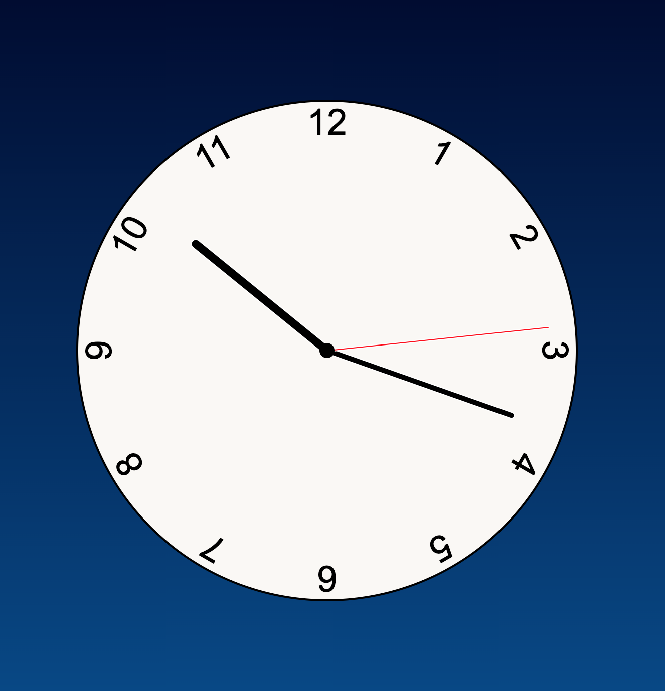

# Javascript Clock

Made using HTML, CSS, and Javascript this is a functioning clock. To try it out, clone the code and open index.html in a [live server](https://marketplace.visualstudio.com/items?itemName=ritwickdey.LiveServer). If you do not have one installed in your editor I have provided the link to the live server extension I use for Visual Studio Code.

